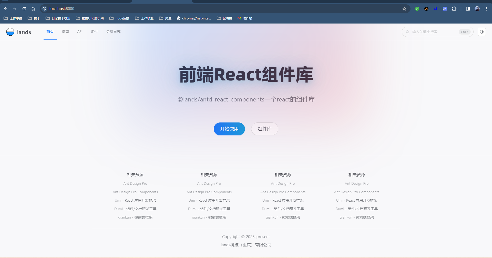
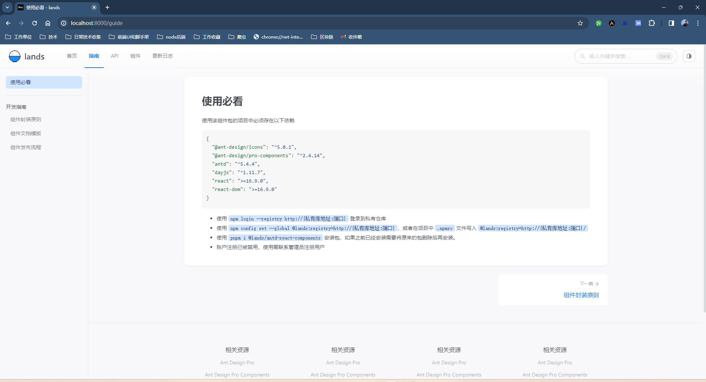
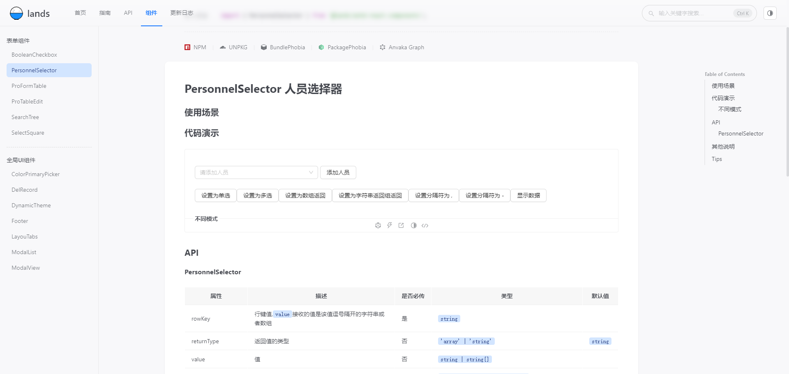
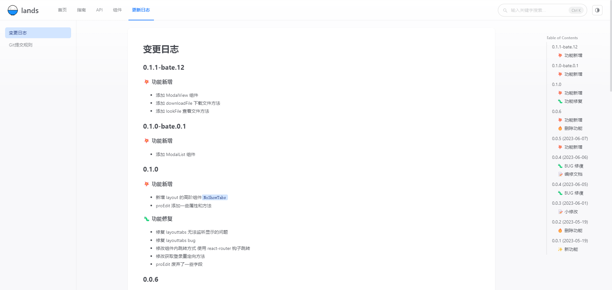

## 介绍

本仓库是一个文档与组件集于一体的仓库，里面包含了一些常用的 react 组件，便于快速开发。
可以将本项目克隆下来后，自己发布到自己的私有库上。

## 用法

将项目启动后内部有介绍

## 效果






## Development

```bash
# install dependencies
$ pnpm install

# develop library by docs demo
$ pnpm start

# build library source code
$ pnpm run build

# build library source code in watch mode
$ pnpm run build:watch

# build docs
$ pnpm run docs:build

# check your project for potential problems
$ pnpm run doctor
```

## git commit 方法

```
 [<emoji>] [revert: ?]<type>[(scope)?]: <message>

💥 feat(compiler): 添加 'comments' 选项
🐛 fix(compiler): 修复一些错误
📝 docs(compiler): 添加一些文档
🌷 UI(compiler): 更好的样式
🏰 chore(compiler): 对脚手架进行了一些更改
🌐 locale(compiler): 国际化
```

## LICENSE

MIT
