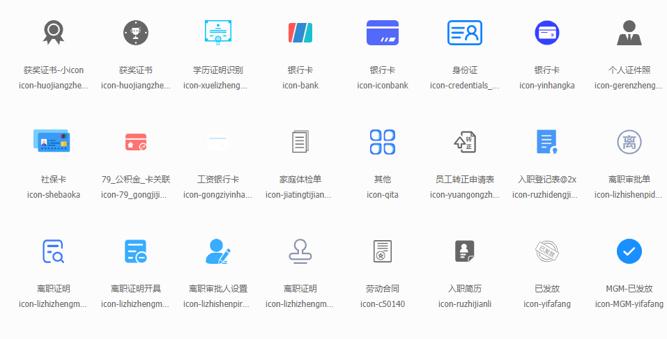

---
nav:
  title: API
  order: 5
title: 工具API
order: 1
---

# API

## 数据结构类

### list 转 map

`listToMap<T>(): Record<NumberString | symbol, T>`

将 List 结构数据转换成 Map 结构数据方便与快速查询和生成组件所需数据，其中还提供了对象数据衍生和对象数据删除

#### 基本使用

```jsx
import React, { useState } from 'react';
import ReactJson from 'react-json-view';

import { listToMap } from '@lands-pro/antd-react-components/dist/utils';
const data = [
  { id: 'id1', a: 1, b: 2, c: 3, d: 4, children: [] },
  { id: 'id2', a: 1, b: 2, c: 3, d: 4, children: [] },
];
const map = listToMap(data, 'id');
export default () => {
  const props = {
    name: false,
    iconStyle: 'circle',
    displayDataTypes: false,
    displayObjectSize: false,
    collapsed: 1,
  };
  return (
    <>
      转换前：
      <ReactJson src={data} {...props} />
      转换后：
      <ReactJson src={map} {...props} />
    </>
  );
};
```

#### 进阶使用

```jsx
import React, { useState } from 'react';
import ReactJson from 'react-json-view';

import { listToMap } from '@lands-pro/antd-react-components/dist/utils';

type returnMapType = {
  a: number;
  b: number;
  c: number;
  d: number;
  children: any[];
};
const data = [
  { id: 'id1', title:'我是ID1', children: [] },
  { id: 'id2', title:'我是ID2', children: [] },
];
const map = listToMap<returnMapType>(
  JSON.parse(JSON.stringify(data)),
  'id',
  { oldField: ['id','title'], field: ['key','label'] },
  ['a'],
);
export default () => {
  const props = {
    name: false,
    iconStyle: 'circle',
    displayDataTypes: false,
    displayObjectSize: false,
    collapsed: 1,
  };
  return (
    <>
      转换前：
      <ReactJson src={data} {...props} />
      转换后：
      <ReactJson src={map} {...props} />
    </>
  );
};
```

#### 参数

`type NumberString = string | number`

| 属性   | 描述                                          | 是否必须 | 类型                                                           | 默认值         |
| ------ | --------------------------------------------- | -------- | -------------------------------------------------------------- | -------------- |
| `data` | 原始 list 数据                                | 是       | ` Record<NumberString \| symbol, any>[]`                       |                |
| `key`  | 生成 map 的索引，会将`data[key]`作为 map 的键 | 是       | `string\|number`                                               |                |
| `F`    | `data`会根据该值衍生对象                      | 否       | `{ oldField: NumberString[]; field: NumberString[] }  \| null` |
| `D`    | `data`会根据该值删除对象                      | 否       | `Array<NumberString \| NumberString[]>}`                       | `['children']` |
| 返回值 | 使用该方法生成的 map 对象                     | 是       | `Record<NumberString \| symbol, T>`                            | `{}`           |

#### 泛型

| 泛型名称 | 描述                                                            | 是否必传 | 默认值                          |
| -------- | --------------------------------------------------------------- | -------- | ------------------------------- |
| `T`      | 返回的数据类型包含该泛型 T，`Record<NumberString \| symbol, T>` | 否       | `T = Record<NumberString, any>` |

### tree 转 map

`treeToMap<T>(): Record<NumberString | symbol, T>`

将 List 结构数据转换成 Map 结构数据方便与快速查询和生成组件所需数据

#### 基本使用

```jsx
import React, { useState } from 'react';
import ReactJson from 'react-json-view';

import { treeToMap } from '@lands-pro/antd-react-components/dist/utils';

const data = [
  {
    id: 'id1',
    title: '我是ID1',
    children: [{ id: 2, title: '我是ID2', children: [] }],
  },
];
const map = treeToMap(JSON.parse(JSON.stringify(data)), 'id');
export default () => {
  const props = {
    name: false,
    iconStyle: 'circle',
    displayDataTypes: false,
    displayObjectSize: false,
    collapsed: 1,
  };
  return (
    <>
      转换前：
      <ReactJson src={data} {...props} />
      转换后：
      <ReactJson src={map} {...props} />
    </>
  );
};
```

#### 进阶使用

```jsx
import React, { useState } from 'react';
import ReactJson from 'react-json-view';

import { treeToMap } from '@lands-pro/antd-react-components/dist/utils';

const data = [
  {
    id: 'id1',
    title: '我是ID1',
    next: [{ id: 'id2', title: '我是ID2', next: [] }],
  },
];
const map = treeToMap(JSON.parse(JSON.stringify(data)), 'id', 'next', false);
export default () => {
  const props = {
    name: false,
    iconStyle: 'circle',
    displayDataTypes: false,
    displayObjectSize: false,
    collapsed: 1,
  };
  return (
    <>
      转换前：
      <ReactJson src={data} {...props} />
      转换后：
      <ReactJson src={map} {...props} />
    </>
  );
};
```

#### 参数

`type NumberString = string | number`

| 属性            | 描述                                          | 是否必须 | 类型                                     | 默认值     |
| --------------- | --------------------------------------------- | -------- | ---------------------------------------- | ---------- |
| `data`          | 原始 list 数据                                | 是       | ` Record<NumberString \| symbol, any>[]` |            |
| `key`           | 生成 map 的索引，会将`data[key]`作为 map 的键 | 是       | `string\|number`                         |            |
| `childrenKey`   | data 树形结构中子对象的 Key                   | 否       | `string\|number`                         | `children` |
| `isDelChildren` | 是否删除 `data[children]`                     | 否       | `boolean`                                | `true`     |
| 返回值          | 使用该方法生成的 map 对象                     | 是       | `Record<NumberString \| symbol, T>`      | `{}`       |

#### 泛型

| 泛型名称 | 描述                                                            | 是否必传 | 默认值                          |
| -------- | --------------------------------------------------------------- | -------- | ------------------------------- |
| `T`      | 返回的数据类型包含该泛型 T，`Record<NumberString \| symbol, T>` | 否       | `T = Record<NumberString, any>` |

### list 转 Tree

`listToTree<T, U>(): T & { [key in U]: T }`

list 对象数组转树 兼容多棵树 多个顶点情况，该方法会影响原始对象

#### 基本使用

```jsx
import React, { useState } from 'react';
import ReactJson from 'react-json-view';

import { listToTree } from '@lands-pro/antd-react-components/dist/utils';

const data = [
  { id: 1, a: 1, b: 2, c: 3, d: 4, parentId: '-1' },
  { id: 2, a: 1, b: 2, c: 3, d: 4, parentId: '1' },
  { id: 3, a: 1, b: 2, c: 3, d: 4, parentId: '1' },
];

const tree = listToTree({
  data: JSON.parse(JSON.stringify(data)),
  id: 'id',
});
export default () => {
  const props = {
    name: false,
    iconStyle: 'circle',
    displayDataTypes: false,
    displayObjectSize: false,
    collapsed: 1,
  };
  return (
    <>
      转换前：
      <ReactJson src={data} {...props} />
      转换后：
      <ReactJson src={tree} {...props} />
    </>
  );
};
```

#### 进阶使用

衍生`'key', 'value', 'title', 'label'`, 删除`name=='lantao4'`

```jsx
import React, { useState } from 'react';
import ReactJson from 'react-json-view';

import { listToTree } from '@lands-pro/antd-react-components/dist/utils';

const data = [
  { userId: 'userid1', name: 'lantao', pid: '-1' },
  { userId: 'userid2', name: 'lantao2', pid: 'userid1' },
  { userId: 'userid3', name: 'lantao3', pid: 'userid2' },
  { userId: 'userid4', name: 'lantao4', pid: 'userid3' },
];
const tree = listToTree({
  data: JSON.parse(JSON.stringify(data)),
  id: 'userId',
  pid: 'pid',
  children: 'next',
  F: {
    oldField: ['userId', 'userId', 'name', 'name'],
    field: ['key', 'value', 'title', 'label'],
  },
  D: {
    key: 'name',
    value: 'lantao4',
    self: true,
  },
});
export default () => {
  const props = {
    name: false,
    iconStyle: 'circle',
    displayDataTypes: false,
    displayObjectSize: false,
    collapsed: 1,
  };
  return (
    <>
      转换前：
      <ReactJson src={data} {...props} />
      转换后：
      <ReactJson src={tree} {...props} />
    </>
  );
};
```

#### 参数

`type NumberString = string | number`

| 属性         | 描述                                             | 是否必须 | 类型                                     | 默认值     |
| ------------ | ------------------------------------------------ | -------- | ---------------------------------------- | ---------- |
| `v.data`     | 原始 list 数据                                   | 是       | ` Record<NumberString \| symbol, any>[]` |            |
| `v.id`       | data 数据中的主键，用于作为生成树的依据          | 否       | `string\|number`                         | `id`       |
| `v.pid`      | data 数据中的父主键，用于作为生成树的依据        | 否       | `string\|number`                         | `parentId` |
| `v.children` | 生成的树形结构会用 `children` 作为下一级接收对象 | 否       | `string\|number`                         | `children` |
| `v.F`        | 会根据此对象做出数据衍生                         | 否       | `FProps`                                 | `true`     |
| `v.D`        | 会根据此对象做出数据去除                         | 否       | `DProps`                                 | `true`     |
| 返回值       | 使用该方法生成的 tree 对象                       | 是       | `T & { [key in U]: T }`                  | `{}`       |

`DProps`

| 属性    | 描述                                                             | 是否必须 | 类型                 | 默认值 |
| ------- | ---------------------------------------------------------------- | -------- | -------------------- | ------ |
| `key`   | key                                                              | 是       | `string\|number`     |        |
| `value` | data[key] === value 时会触发条件                                 | 是       | `any`                |        |
| `self`  | data[key] === value 时，是否删除自身                             | 否       | `boolean`            |        |
| `field` | data[key] === value 时，删除选定对象的 所有 field 数组中的子对象 | 否       | `(string\|number)[]` |        |

`FProps`

| 属性       | 描述                            | 是否必须 | 类型              | 默认值 |
| ---------- | ------------------------------- | -------- | ----------------- | ------ |
| `oldField` | 对象原来的子对象的 key 数组     | 是       | ` NumberString[]` |        |
| `field`    | 生成新的对象的子对象的 key 数组 | 是       | ` NumberString[]` |        |

#### 泛型

| 泛型名称 | 描述                                                | 是否必传 | 默认值                      |
| -------- | --------------------------------------------------- | -------- | --------------------------- |
| `T`      | 返回的数据类型包含该泛型 T，`T & { [key in U]: T }` | 否       | `Record<NumberString, any>` |
| `U`      | 树形结构的下级接收对象                              | 否       | `children`                  |

### 深拷贝

#### 基本使用

```ts
import { utils } from '@lands-pro/antd-react-components';
const { deepCopy } = utils;
let obj = { a: 1, b: 2, d: { E: {} } };
obj.d.E = obj;
let objProxy = deepCopy(obj);
console.log(obj.d, objProxy.d); // 输出：false
console.log(obj.d.E, objProxy.d.E); // 输出：true
```

#### 参数

| 属性    | 描述           | 是否必须 | 类型              | 默认值          |
| ------- | -------------- | -------- | ----------------- | --------------- |
| `obj`   | 需要复制的对象 | 是       | `Record<any,any>` |                 |
| `cache` | 缓存信息       | 否       | `string`          | `new WeakMap()` |

### 数组转对象-用于字典

IToValueEnum 将数组转换成 map，便于用在下拉选择框等组件上

#### 基本使用

```ts
import { utils } from '@lands-pro/antd-react-components';
const { IToValueEnum } = utils;
let dict = [{ id: 1, name: 'lantao',tel:'15723185734' },{ id: 2, name: 'lantao2',tel:'15723185731' }];
console.log(IToValueEnum({dict,fieldName:{textString:'name',valueString:'id'}}); // 输出：Map({1:{ id: 1, name: 'lantao',tel:'15723185734' },2:{ id: 2, name: 'lantao2',tel:'15723185731' }})
```

#### 参数

| 属性    | 描述                          | 是否必须 | 类型                | 默认值 |
| ------- | ----------------------------- | -------- | ------------------- | ------ |
| `Props` | 需要转换成字典信息 map 的对象 | 是       | `IToValueEnumProps` |        |

##### IToValueEnumProps

| 属性        | 描述                  | 是否必须 | 类型                                            | 默认值                                     |
| ----------- | --------------------- | -------- | ----------------------------------------------- | ------------------------------------------ |
| `dict`      | 需要转换的数组        | 是       | `Record<string,any>[]`                          |                                            |
| `start`     | 从第几项开始处理      | 否       | `number`                                        | `0`                                        |
| `end`       | 从第几项结束处理      | 否       | `number`                                        | `dict.length`                              |
| `fieldName` | 描述怎么生成 Map      | 否       | `{ textString?: string; valueString?: string }` | `{textString:'text', valueString:'value'}` |
| `keyType`   | 需要生成的 Key 的类型 | 否       | ` 'string' \| 'number' \| 'boolean'`            | `string`                                   |

### 复制对象

copyAndAdd 会对原数据影响

#### 基本使用

```ts
import { utils } from '@lands-pro/antd-react-components';
const { copyAndAdd } = utils;
let obj = { id: 1, name: 'lantao',tel:'15723185734' };
console.log(copyAndAdd(obj,{ oldField: ['id','name']; field: string['value','label'] })); // 输出：{ id: 1, name: 'lantao',value: 1, label: 'lantao',tel:'15723185734' }
```

#### 参数

| 属性  | 描述           | 是否必须 | 类型                                      | 默认值 |
| ----- | -------------- | -------- | ----------------------------------------- | ------ |
| `obj` | 需要处理的对象 | 是       | `Record<any,any>`                         |        |
| `F`   | 处理信息       | 是       | `{ oldField: string[]; field: string[] }` |        |

### 复制对象仅返回所需值

copyAndAdd2 会对原数据影响，仅仅返回 field 描述了的数据

#### 基本使用

```ts
import { utils } from '@lands-pro/antd-react-components';
const { copyAndAdd2 } = utils;
let obj = { id: 1, name: 'lantao',tel:'15723185734' };
console.log(copyAndAdd2(obj,{ oldField: ['id','id','name']; field: string['value','key','label'] })); // 输出：{ value: 1, key: 1, label: 'lantao' }
```

#### 参数

| 属性  | 描述           | 是否必须 | 类型                                      | 默认值 |
| ----- | -------------- | -------- | ----------------------------------------- | ------ |
| `obj` | 需要处理的对象 | 是       | `Record<any,any>`                         |        |
| `F`   | 处理信息       | 是       | `{ oldField: string[]; field: string[] }` |        |

## 转换类方法

### dayjs 转 string

`formatDate(): string`

#### 基本使用

```jsx
import { formatDate } from '@lands-pro/antd-react-components/dist/utils';
import dayjs from 'dayjs';
const now = dayjs();

export default () => {
  const date = formatDate(now, 'date');
  const dateTime = formatDate(now, 'dateTime');
  const dateWeek = formatDate(now, 'dateWeek');
  const dateMonth = formatDate(now, 'dateMonth');
  const dateQuarter = formatDate(now, 'dateQuarter');
  const dateYear = formatDate(now, 'dateYear');
  const time = formatDate(now, 'time');

  const dateRange = formatDate([now, dayjs('2029-12-03')], 'dateRange');
  const dateTimeRange = formatDate([now, dayjs('2029-12-03')], 'dateTimeRange');
  const timeRange = formatDate([now, dayjs('2029-12-03')], 'timeRange');
  return (
    <>
      date： {date}
      <br />
      dateTime： {dateTime}
      <br />
      dateWeek： {dateWeek}
      <br />
      dateMonth： {dateMonth}
      <br />
      dateQuarter： {dateQuarter}
      <br />
      dateYear： {dateYear}
      <br />
      time： {time}
      <br />
      dateRange： {JSON.stringify(dateRange)}
      <br />
      dateTimeRange： {JSON.stringify(dateTimeRange)}
      <br />
      timeRange： {JSON.stringify(timeRange)}
    </>
  );
};
```

#### 参数

| 属性       | 描述       | 是否必须 | 类型            | 默认值 |
| ---------- | ---------- | -------- | --------------- | ------ |
| `date`     | 图标名称   | 是       | `dayjs \| date` |        |
| `dateType` | 图标大小   | 是       | `dateTypeProps` |        |
| 返回值     | 时间字符串 | 是       | `string`        |        |

##### dateTypeProps

```ts
export type dateTypeProps =
  | 'date'
  | 'dateTime'
  | 'dateWeek'
  | 'dateMonth'
  | 'dateQuarter'
  | 'dateYear'
  | 'dateRange'
  | 'dateTimeRange'
  | 'time'
  | 'timeRange';
```

### 将 Dom 转换成 Tag

`returnTag():ReactDom`

#### 基本使用

```jsx
import { returnTag } from '@lands-pro/antd-react-components/dist/utils';
const value = '1';
const obj = { 1: '男', 2: '女' };
const label = obj[value];
const dom = <div>{label}</div>;

export default () => {
  return <>{returnTag(dom, value)}</>;
};
```

#### 进阶使用

```jsx
import { returnTag } from '@lands-pro/antd-react-components/dist/utils';
const value = '2';
const obj = { 1: '男', 2: '女' };
const label = obj[value];
const dom = <div>{label}</div>;

export default () => {
  return <>{returnTag(dom, value, { 1: 'green', 2: 'red' })}</>;
};
```

#### 参数

| 属性    | 描述                   | 是否必须 | 类型                            | 默认值                      |
| ------- | ---------------------- | -------- | ------------------------------- | --------------------------- |
| `dom`   | 渲染对象               | 是       | `dayjs \| date`                 |                             |
| `value` | 渲染对象的值           | 是       | `string\|number`                |                             |
| `color` | 渲染对象的颜色映射 map | 否       | `Record<string\|number,string>` | [见明细](#color-默认值明细) |
| 返回值  | 时间字符串             | 是       | `string`                        |                             |

#### color 默认值明细

```ts
switch (String(value)) {
  case 'Y':
    node = <Tag color={colors?.[0] || 'green'}>{dom}</Tag>;
    break;
  case 'N':
    node = <Tag color={colors?.[1] || 'red'}>{dom}</Tag>;
    break;
  case 'Z':
    node = <Tag color={colors?.[1] || 'blue'}>{dom}</Tag>;
    break;
  case '0':
    node = <Tag color={colors?.[0] || 'red'}>{dom}</Tag>;
    break;
  case '1':
    node = <Tag color={colors?.[1] || 'green'}>{dom}</Tag>;
    break;
  case '2':
    node = <Tag color={colors?.[2] || 'cyan'}>{dom}</Tag>;
    break;
  case '3':
    node = <Tag color={colors?.[3] || 'blue'}>{dom}</Tag>;
    break;
  case '4':
    node = <Tag color={colors?.[4] || 'geekblue'}>{dom}</Tag>;
    break;
  case '5':
    node = <Tag color={colors?.[5] || 'purple'}>{dom}</Tag>;
    break;
  case '6':
    node = <Tag color={colors?.[6] || 'magenta'}>{dom}</Tag>;
    break;
  case '7':
    node = <Tag color={colors?.[6] || 'red'}>{dom}</Tag>;
    break;
  case '8':
    node = <Tag color={colors?.[6] || 'volcano'}>{dom}</Tag>;
    break;
}
```

### 色彩转换

`adjustColor(): string （rgb）`
此方法可以根据参数转换色彩，例如 `Layouttabs` 组件的选择项的背景色是根据该方法转换的。
类似于 `less` 的 `hsl()` 函数，但区别在于该函数在运行时执行，`hsl` 在编译是执行

#### 基本使用

```jsx
import { adjustColor } from '@lands-pro/antd-react-components/dist/utils';

export default () => {
  return (
    <>
      <div style={{ height: 30, background: '#1677ff' }}> 转换前 #1677ff</div>
      <div style={{ height: 30, background: adjustColor('#1677ff', 0.5, 0.5) }}>
        转换后 ：{adjustColor('#1677ff', 0.5, 0.5)}
      </div>
    </>
  );
};
```

#### 参数

| 属性         | 描述             | 是否必须 | 类型     | 默认值 |
| ------------ | ---------------- | -------- | -------- | ------ |
| `hexColor`   | 原始 16 进制色彩 | 是       | `string` |        |
| `brightness` | 亮点             | 是       | `number` |        |
| `saturation` | 饱和度           | 是       | `number` |        |
| 返回值       | 时间字符串       | 是       | `string` |        |

### 函数柯里化

`curry(fn):function|ReturnType<fn>`
使用该方法可以将一个函数变成单参函数，由于 ts 类型标注问题，curry 自身接收两个参数，第二个参数是 Parameters\<fn\>

#### 基本使用

```ts
import { curry } from '@lands-pro/antd-react-components/dist/utils';
const sum = (a: number, b: number, c: number) => a + b + c;
const currySum = curry(sum, 1, 2);
currySum(3); //6
currySum(4); //7

const currySum1 = curry(sum, 1);
currySum1(2)(3); //6
curry(sum, 1, 2, 3); //6
curry(sum, 1)(2)(3); //6
```

#### 参数

| 属性      | 描述                                               | 是否必须 | 类型                       | 默认值 |
| --------- | -------------------------------------------------- | -------- | -------------------------- | ------ |
| `fn`      | 需要被柯里化的函数                                 | 是       | `function`                 |        |
| `...args` | 需要被柯里化的函数的参数                           | 否       | `Parameters<fn>`           |        |
| 返回值    | 如果参数不够返回新的函数，如果参数满足返回 fn 的值 | 是       | `function\|ReturnType<fn>` |        |

### 获取单项加密值

`sha256Hash():string` 异步方法
该方法用于密码加密，系统中的所有密码都是前端单项加密后传达给后端，在登录的时候也是将加密数据传过去验证

#### 基本使用

```jsx
import { sha256Hash } from '@lands-pro/antd-react-components/dist/utils';
import { useState, useEffect } from 'react';
export default () => {
  const [pwd, setPwd] = useState();
  useEffect(() => {
    sha256Hash('123456').then((data) => {
      setPwd(data);
    });
  }, []);
  return (
    <>
      <div>加密前：{123456}</div>
      <div>单项加密后：{pwd}</div>
    </>
  );
};
```

#### 参数

| 属性        | 描述             | 是否必须 | 类型     | 默认值 |
| ----------- | ---------------- | -------- | -------- | ------ |
| `plainText` | 需要加密的字符串 | 是       | `string` |        |
| 返回值      | 时间字符串       | 是       | `string` |        |

### 转换成图标

基于[iconfont](https://www.iconfont.cn/)字符串

`getIcon(): ReactDom`

#### 基本使用

```jsx
import React, { useState } from 'react';
import ReactJson from 'react-json-view';
import { getIcon } from '@lands-pro/antd-react-components/dist/utils';

export default () => {
  return <>{getIcon('icon-bank')}</>;
};
```

#### 进阶使用

```jsx
import React, { useState } from 'react';
import ReactJson from 'react-json-view';
import { getIcon } from '@lands-pro/antd-react-components/dist/utils';
const icon = getIcon(
  'icon-bank',
  40,
  'icon',
  'https://lands-dev.oss-cn-beijing.aliyuncs.com/%E5%89%8D%E7%AB%AF%E5%BC%80%E5%8F%91/%E9%A1%B9%E7%9B%AE%E9%9D%99%E6%80%81%E8%B5%84%E6%BA%90/iconfont.js',
);
export default () => {
  return <>{icon}</>;
};
```



#### 参数

| 属性           | 描述                       | 是否必须 | 类型             | 默认值                                                                                                                                                            |
| -------------- | -------------------------- | -------- | ---------------- | ----------------------------------------------------------------------------------------------------------------------------------------------------------------- |
| `icon`         | 图标名称                   | 是       | `string`         |                                                                                                                                                                   |
| `fontSize`     | 图标大小                   | 否       | `string\|number` | `20`                                                                                                                                                              |
| `iconPrefixes` | 图标前缀                   | 否       | `string`         | `parentId`                                                                                                                                                        |
| `iconfontUrl`  | 图标地址                   | 否       | `string`         | [oss 地址](https://lands-dev.oss-cn-beijing.aliyuncs.com/%E5%89%8D%E7%AB%AF%E5%BC%80%E5%8F%91/%E9%A1%B9%E7%9B%AE%E9%9D%99%E6%80%81%E8%B5%84%E6%BA%90/iconfont.js) |
| 返回值         | 使用该方法生成的 tree 对象 | 是       | `ReactDom`       |                                                                                                                                                                   |

iconfontUrl 的默认值可能会根据版本变化而变化，目前是在/iconFont/iconfont.js 下，也就意味着要将图标文件放入 public/iconFont/iconfont.js 文件夹下。日后是一个 oss 地址

## 获取类

### 获取全局唯一 ID

#### 基本使用

```jsx
import React, { useState } from 'react';
import { getUUID } from '@lands-pro/antd-react-components/dist/utils';
export default () => {
  const [uuid, setUUid] = useState(getUUID());
  return <>{uuid}</>;
};
```

#### 参数

| 属性 | 描述 | 是否必传 | 类型 | 默认值 |
| ---- | ---- | -------- | ---- | ------ |
| 无   | \-   | \-       | \-   | \-     |

### 根据客户端时间返回主题字符串

`dynamicNavTheme():'light' | 'realDark'`
此方法和[DynamicTheme](/components/dynamic-theme)组件一起使用

#### 基本使用

```jsx
import { dynamicNavTheme } from '@lands-pro/antd-react-components/dist/utils';
export default () => {
  return <>{dynamicNavTheme()}</>;
};
```

```jsx
import { dynamicNavTheme } from '@lands-pro/antd-react-components/dist/utils';
export default () => {
  return <>{dynamicNavTheme([12, 0, 0], [13, 0, 0])}</>;
};
```

#### 参数

| 属性        | 描述       | 是否必须 | 类型       | 默认值                  |
| ----------- | ---------- | -------- | ---------- | ----------------------- |
| `startTime` | 区间开始点 | 否       | `number[]` | `[6, 30, 0]`            |
| `endTime`   | 区间结束点 | 否       | `number[]` | `[19, 30, 0]`           |
| 返回值      | 时间字符串 | 是       | `string`   | `'light' \| 'realDark'` |

### 获取系统登录地址

系统的默认登录地址在`'/user/login'`，如果系统没有将登录组件放在此地址下，则需要自己在项目中单独导出变量供全局使用。建议登录地址放在 user/login 目录下，如果不放在该目录下，也需要创建变量全局管理。

```ts
import { globalPath } from '@lands-pro/antd-react-components/dist/utils';
console.log(globalPath.loginPath); // '/user/login'
console.log(globalPath.loginPathRedirect); // '/user/login?redirect=xxxxx' 当前页面重定向当登录页的地址
```

### 获取当前环境是否处于开发模式

```ts
import { isDev } from '@lands-pro/antd-react-components/dist/utils';

console.log(isDev); // true||false
```

## 功能类

### 在线查看文件

`lookFile(fileUrl: string)`
使用该方法可基于 KKfile 预览文件

#### 基本使用

```ts
import { lookFile } from '@lands-pro/antd-react-components/dist/utils';
lookFile('https://xxx.com/1.pdf');
```

#### 参数

| 属性      | 描述     | 是否必须 | 类型     | 默认值 |
| --------- | -------- | -------- | -------- | ------ |
| `fileUrl` | 预览地址 | 是       | `string` |        |

### 下载文件

`downloadFile(fileUrl: string, fileName: string)`
使用该方法下载文件

#### 基本使用

```ts
import { downloadFile } from '@lands-pro/antd-react-components/dist/utils';
downloadFile('https://xxx.com/1.pdf', '1.pdf');
```

#### 参数

| 属性       | 描述     | 是否必须 | 类型     | 默认值 |
| ---------- | -------- | -------- | -------- | ------ |
| `fileUrl`  | 下载地址 | 是       | `string` |        |
| `fileName` | 文件名   | 是       | `string` |        |

### 判断请求是否正常

`isCodeSuccess():true|false`
使用该方法需要配置，详细请看[ProTableEdit Tips 第一条](/components/pro-table-edit#tips)

#### 基本使用

```ts
import { isCodeSuccess } from '@lands-pro/antd-react-components/dist/utils';
const res = await system.getUserInfo();
isCodeSuccess(res.bizCode);
```

#### 参数

| 属性   | 描述                     | 是否必须 | 类型     | 默认值 |
| ------ | ------------------------ | -------- | -------- | ------ |
| `code` | 经过请求拦截器处理的标识 | 是       | `string` |        |
| 返回值 | 该请求是否通过后端验证   | 是       | `true`   |        |
