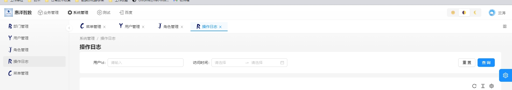

---
nav:
  title: 组件
  order: 3
group: 全局UI组件
title: LayouTabs
---

# LayouTabs 页脚

点击路由变化有会自动新增一个`tabs`


## 使用场景

在搭建系统的时候，需要一个快捷访问的 tabs 历史记录时。

## 代码演示

此处的案例只能显示 1 个，是因为该组件被摧毁了，在实际使用中将该组件放入 layout.tsx 文件中，该组件会自动监听路由变化

```tsx
import { LaptopOutlined } from '@ant-design/icons';
import { LayouTabs } from '@lands/antd-react-components';

const data = [
  {
    name: 'Layou Tabs',
    icon: <LaptopOutlined />,
    path: '/components/layou-tabs',
  },
  {
    name: 'footer',
    icon: <LaptopOutlined />,
    path: '/components/footer',
  },
];

export default () => {
  return (
    <>
      <LayouTabs menuData={data} />
    </>
  );
};
```

## API

| 方法                   | 描述                                          |
| ---------------------- | --------------------------------------------- |
| handleShowGlobalTabBar | 控制是否显示，传值为布尔类型,flase 代表不显示 |
| clearGlobalTabs        | 清空现在的所有 Tabs                           |

### Props

| 属性        | 描述                                                         | 是否必传 | 类型                                                     |
| ----------- | ------------------------------------------------------------ | -------- | -------------------------------------------------------- |
| menuData    | 菜单数据                                                     | 是       | [MenuDataItem](#menudataitem)                            |
| navTheme    | 导航主题，如果传入的值是 `realDark` 内部算法会自动暗化主题色 | 是       | [navThemeProps](/components/dynamic-theme#navthemeprops) |
| ...divProps | 该组件最外层 DIv 的属性                                      | 否       | HTMLDivElement                                           |

只要`menuData`对象中包含了`name` `icon` `key` `children`该组件就能正常运行

```js
// 建议给menuData赋值为：
import { utils } from '@lands-react-components';
const { listToTree } = utils;
const menuData = listToTree({
  data: JSON.parse(JSON.stringify(systemInfo.menus)),
  id: 'menuId',
  F: {
    field: ['name', 'icon', 'access', 'value', 'title', 'key'],
    oldField: ['menuName', 'Icon', 'perms', 'menuId', 'menuName', 'menuId'],
  },
  D: {
    self: true,
    key: 'menuType',
    value: 'F',
  },
});
//  systemInfo.menus是一个带有'menuName', 'Icon', 'perms', 'menuId', 'menuName', 'menuId'的list对象 listToTree方法会自动将该对象转换成树形带有'name', 'icon', 'access', 'value', 'title', 'key'结构
```

### MenuDataItem

来源于`import type { MenuDataItem } from '@umijs/route-utils';`

| 属性                  | 描述                         | 是否必传 | 类型              |
| --------------------- | ---------------------------- | -------- | ----------------- |
| children              | 子菜单项                     | 否       | `MenuDataItem[]`  |
| hideChildrenInMenu    | 在菜单中隐藏子菜单           | 否       | `boolean`         |
| hideInMenu            | 在菜单中隐藏菜单项           | 否       | `boolean`         |
| icon                  | 菜单项图标                   | 否       | `any`             |
| locale                | 国际化标识                   | 否       | `string \| false` |
| name                  | 菜单项名称                   | 否       | `string`          |
| key                   | 菜单项唯一标识               | 否       | `string`          |
| pro_layout_parentKeys | ProLayout 父级菜单项标识数组 | 否       | `string[]`        |
| path                  | 菜单项路径                   | 否       | `string`          |
| parentKeys            | 父级菜单项标识数组           | 否       | `string[]`        |
| [key: string]         | 其他自定义属性               | -        | `any`             |

## 其他说明

如果不想显示 layouttabs 可使用`NoShowTabs` 高阶组件

```
export default NoShowTabs(fn)
```

## Tips

无
