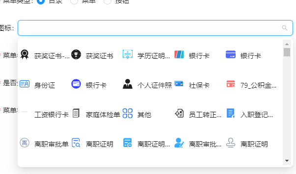

---
nav:
  title: 组件
  order: 10
group: 表单组件
title: SelectSquare
---

# SelectSquare 图标下拉选择框

该组件没有做虚拟滑动，如果在使用中发现卡顿，请来更新该组件

## 使用场景

使用 `select` 下拉框需要显示一行多个选项时

## 代码演示

无

## API

### props

| 属性             | 描述                       |
| ---------------- | -------------------------- |
| `...SelectProps` | Ant Design Select 的 Prosp |

## 其他说明

无

## Tips

- 提示
